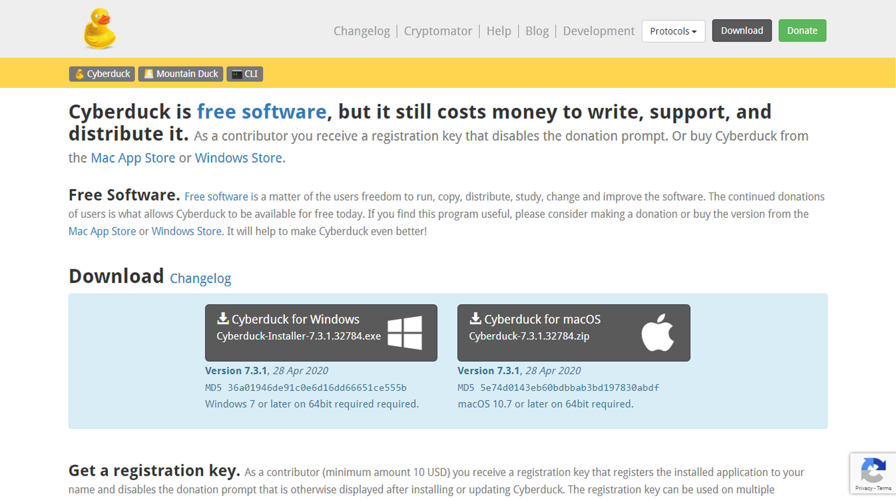
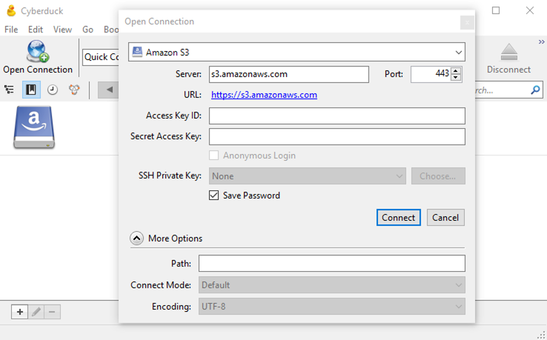
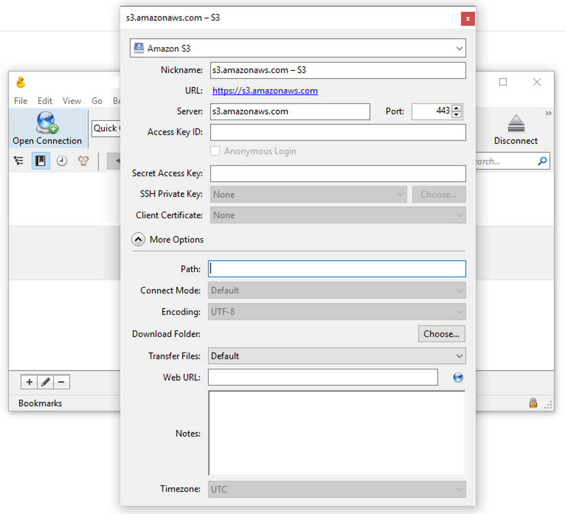
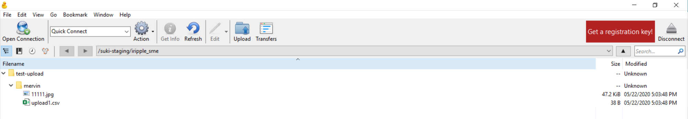
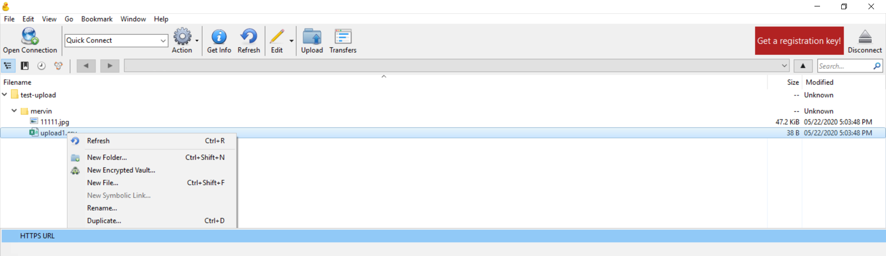
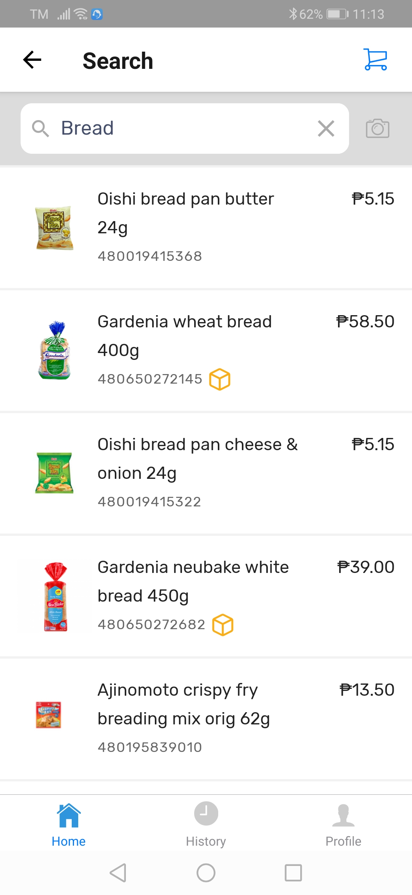
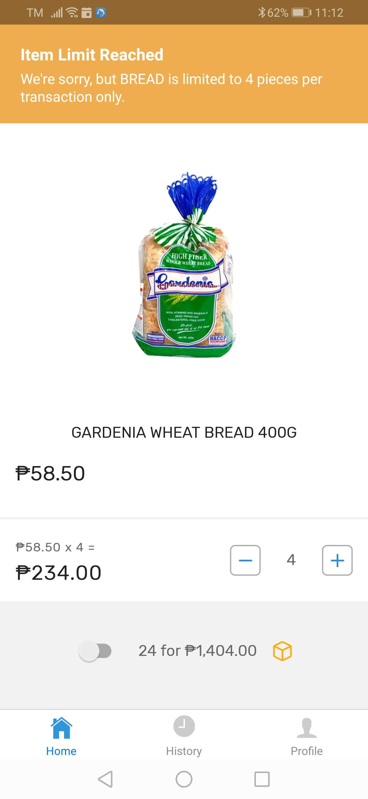
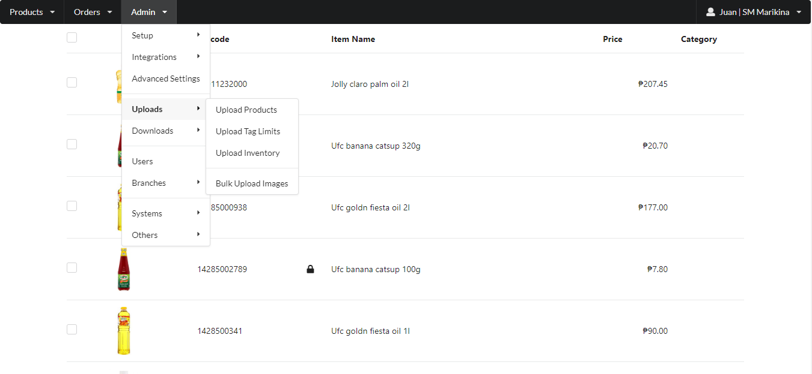

# Manage other product description

## List of Other CSV file that can be uploaded on Vendors portal

| Product Upload Description                                                                   | CSV file Headers                                                             |
| -------------------------------------------------------------------------------------------- | ---------------------------------------------------------------------------- |
| [Bulk Images](manage-other-product-description.md#upload-bulk-images)                        | barcode, name, img\_file                                                     |
| [Product Limit (via Barcode)](manage-other-product-description.md#product-limit-via-barcode) | barcode, limit                                                               |
| [Product Limit (via Tags)](manage-other-product-description.md#product-limit-via-tags)       | tag, limit                                                                   |
| [Popular Products](manage-other-product-description.md#upload-popular-products)              | barcode, name, alt\_category, alt\_subcategory                               |
| [Weighted Items](../suki-integrations/weighted-items/)                                       | barcode, price, approx\_weight, unit\_in\_weight, price\_per\_unit, variable |


Click the **Product Upload Description** for further guide on how to prepare the CSV file


## Upload Bulk Images

The vendor has an option to upload product images for the unique items that they have. This section contains instructions on how to upload bulk images using a CSV file as matching list

### Preparing the CSV File

Barcode, image\_file**To Prepare the Product CSV File**

1. Download the Sample Template CSV File [Here](https://docs.google.com/spreadsheets/d/1QNGs8E4O82r\_8KqVKg0CHX5-EnHN0WwOK8MyTVBM9GE/edit#gid=989010927\&range=A1)
2. Open the file in Google Sheets and Navigate to the **BULK IMAGES TAB**
3. You will see some sample entries
4. Replace the examples with your products
   * Barcode
   * Name
   * Image File
5. Save the file in a CSV Format
6. Click File > Download > Comma-separated values (.csv)


To have the best image display at the vendor portal or mobile application, it is recommended that the images to be uploaded would have a 1x1 ratio aka square picture (ex. 800x800px, 300x300px)


| barcode       | name                                    | image\_file       |
| ------------- | --------------------------------------- | ----------------- |
| 4800361379397 | NESTLE BEAR BRAND MILK ADULT PLUS 180GM | 4800361379397.jpg |

### Download and Set Up Cyberduck

Cyberduck is a tool used to upload files to the serverDownload Cyberduck from this link: [https://cyberduck.io/download/](https://cyberduck.io/download/)

<figure><figcaption></figcaption></figure>

#### **To Connect to the Server**

1. Download and Open the Cyberduck Application
2. Click on Open Connection
3. At the Server choose Amazon S3
4. Enter your Access Key Id and Secret Access Key
5. And Click Connect
6. A list of files will be shown

<figure><figcaption></figcaption></figure>

#### **To Add a Bookmark:**

1. Click on the bookmark icon
2. Add a bookmark by Pressing the (+) Icon below
3. At the Server choose Amazon S3
4. Enter your Access Key Id and Secret Access Key
5. At the More Options section Enter the Path
6. Click close, The bookmark will automatically be saved

<figure><figcaption></figcaption></figure>

#### **To Add items to the Bookmark:**

1. Double Click the Bookmark
2. Create a New Folder and name it accordingly
3. Click Refresh to ensure that the folder is added
4. At your local machine, Prepare a Folder Containing the CSV File and Images for Bulk Upload
5. The CSV File must contain the product barcode, the image\_file name and extension
6. Drag the whole folder containing the CSV File and Images from your local machine to your created folder at Cyberduck
7. The file will first be authenticated and Copied to the folder\
   Note: This step may take a long time depending on the number of images to be uploaded it is recommended to upload a thousand images at a time

<figure><figcaption></figcaption></figure>

#### **To get the CSV File Link**

1. Navigate to Cyberduck
2. Locate your CSV File
3. Right Click > Copy URL > Select the First URL (HTTPS)
4. Copy and Paste the URL at the Upload Bulk Images Page

<figure><figcaption></figcaption></figure>

### Upload Images to Portal

1. On the Menu Bar, Navigate to Admin > Uploads > Upload Bulk Images
2. Click the Upload Bulk Images
3. The Product Upload Page will be displayed
4. Enter the URL Copy and Pasted from Cyberduck
5. And Click Confirm
6. You have the option to override the Current Images
7. Tick to Override the current images (optional)
8. Click Confirm

<figure><figcaption></figcaption></figure>

 

<figure><figcaption></figcaption></figure>

## Upload Tag Limits

In compliance to the Memorandum Circular no 20-07, Supplemental Anti-Hoarding and Anti-Panic Buying Directive, states that the retailers and consumers to limit the quantity of certain essential and vital goods that they sell and purchase. This section contains instructions to limit the items that a customer can purchase.

### Product Limit via Tags

Tag, LimitIn compliance to the Memorandum Circular no 20-07, Supplemental Anti-Hoarding and Anti-Panic Buying Directive, states that the retailers and consumers to limit the quantity of certain essential and vital goods that they sell and purchase

#### **To Activate Product Limits**

1. Navigate to Admin > Integrations > My Suki App > Limits
2. Enable the Limits Feature by checking/ticking the checkbox
3. Click Update

<figure><figcaption></figcaption></figure>

 

<figure><figcaption></figcaption></figure>

 

<figure><figcaption></figcaption></figure>

#### **To Prepare the Product CSV File**

1. Download the Sample Template CSV File [Here](https://docs.google.com/spreadsheets/d/1QNGs8E4O82r\_8KqVKg0CHX5-EnHN0WwOK8MyTVBM9GE/edit#gid=1708539396\&range=A1)
2. Open the file in Google Sheets and Navigate to the **PRODUCT TAG LIMIT**
3. You will see some sample entries
4. Replace the examples with your products
   * Tag
   * Limit
5. Save the file in a CSV Format
6. Click File > Download > Comma-separated values (.csv)

| tag     | limit |
| ------- | ----- |
| ALCOHOL | 3     |

#### **To Upload the Products**

1. On the Menu Bar, Navigate to Admin > Uploads > Upload Tag Limits
2. The Upload Tag Limit Page will be displayed
3. Press the Choose File button
4. Navigate to the location of your CSV file and click Proceed
5. Click OK to Upload your File
6. A Notification will appear indicating that you have successfully Uploaded your Products
7. Click OK to close the notification

<figure><figcaption></figcaption></figure>

 

<figure><figcaption></figcaption></figure>

#### **To View Product Limits at Mobile**

1. When a customer tries to order product quantities that exceeds the set limit, the Customer will receive a notification and the currently selected quantity would be reset to the maximum allowable order item quantity

<figure><figcaption></figcaption></figure>

 

<figure><figcaption></figcaption></figure>

 

<figure><figcaption></figcaption></figure>

 

<figure><figcaption></figcaption></figure>

### Product Limit via Barcode

Barcode, LimitIn compliance to the Memorandum Circular no 20-07, Supplemental Anti-Hoarding and Anti-Panic Buying Directive, states that the retailers and consumers to limit the quantity of certain essential and vital goods that they sell and purchase

#### **To Activate Product Limits**

1. Navigate to Admin > System Settings > Limits
2. At the Advanced Settings, Limits Tab, Make sure to Enable the Limits Feature
3. Click Update

<figure><figcaption></figcaption></figure>

 

<figure><figcaption></figcaption></figure>

#### **To Prepare the Product CSV File**

1. Download the Sample Template CSV File [Here](https://docs.google.com/spreadsheets/d/1QNGs8E4O82r\_8KqVKg0CHX5-EnHN0WwOK8MyTVBM9GE/edit#gid=1046194307\&range=A1)
2. Open the file in Google Sheets and Navigate to the **BARCODE PRODUCT LIMIT**
3. You will see some sample entries
4. Replace the examples with your products
   * Barcode
   * Limit
5. Save the file in a CSV Format
6. Click File > Download > Comma-separated values (.csv)

| barcode      | limit |
| ------------ | ----- |
| 480004782024 | 3     |

#### **To Upload the Products**

1. On the Menu Bar, Navigate to Admin > Uploads > Upload Products
2. The Product Upload Modal will be displayed
3. Press the Choose File button
4. Navigate to the location of your CSV file and click Proceed
5. Click OK to Upload your File
6. A Notification will appear indicating that you have successfully Uploaded your Products
7. Click OK to close the notification

<figure><figcaption></figcaption></figure>

 

<figure><figcaption></figcaption></figure>

## Upload Popular Products

The Popular products are the best selling products per category chosen by the vendor to display first at the My Suki Mobile Application. This section contains instructions on uploading and downloading the Popular Products, also generation and Mobile View

### Activate Mobile Bestseller Integration

1. Navigate to the Menu Bar, Admin > Integrations > My Suki App
2. At the General Tab, Present your products as Show Best Sellers
3. Click on Update to Save Changes

### To Set Popular Categories

1. Navigate to the Menu Bar, Admin > Advanced Settings
2. At the Data Tab, Under Popular Categories, Set your Categories
3. Click on Update to Save Changes

#### Reminders:

1. Make sure that the column headers are in the lower case format
2. The Barcode must be properly formatted in the Numeric Format, Non Exponent, No Extra Spaces and Leading Zeroes are Intact
3. The products included in the CSV file must be an Active item at Suki Vendor
4. The Right Product Categories must already be set at the Advanced Settings
5. The Categories set must match the ones indicated at the CSV Popular Product file
6. To Receive error messages regarding the uploading of products, On the Advanced Settings, list your email as an Admin email
7. Min no. of popular products must be 100, Maximum no. of top products must be 500 SKUs for better system optimization

### To Prepare the Product CSV File

1. Download the Sample Template CSV File [Here](https://docs.google.com/spreadsheets/d/1QNGs8E4O82r\_8KqVKg0CHX5-EnHN0WwOK8MyTVBM9GE/edit#gid=284249914\&range=A1)
2. Open the file in Google Sheets and Navigate to the **POPULAR PRODUCTS**
3. You will see some sample entries
4. Replace the examples with your products
   * Barcode
   * Name
   * Alternate Category
   * Alternate Sub-Category
5. Save the file in a CSV Format
6. Click File > Download > Comma-separated values (.csv)

| barcode       | name                                    | alt\_category | alt\_subcategory |
| ------------- | --------------------------------------- | ------------- | ---------------- |
| 4800361379397 | NESTLE BEAR BRAND MILK ADULT PLUS 180GM | MILK          | ADULT MILK       |

### To Upload Popular Products

1. Navigate to Products > Manage Popular Products
2. Click on the Gear Icon > Upload
   * The For Review page must be clear if not click on the Gear Icon > Clear
3. Click on the Choose file and Navigate to the location of your CSV file
4. Click Open and Submit to upload the file
5. A Notification message will appear indicating a successful Popular Product Upload
6. Click OK and Back to view Popular Products for Review

### To Submit the Products for Review

1. Navigate to the Gear Icon > Submit
2. A Notification Message will appear to confirm products going live Click OK to Confirm
3. Confirm successful movement of popular products for review to production Click OK to Confirm
4. Live Products can be viewed at the Manage Popular Products Page > Live Tab


You May Review all the products or filter by category by clicking on the category Tags, Popular products for review are not yet visible at the My Suki Mobile App


### To Download Popular Products List

1. Navigate to the Products > Manage Popular Products > Download
2. The Product List will be downloaded and saved to your local PC


You may download the list from the FOR REVIEW tab or LIVE tab


### To Generate Popular Porducts

1. Navigate to the Products > Manage Popular Products > Gear Icon > Generate
2. A Notification Dialog will appear to Confirm generation of Popular Products
3. Click OK and the generated items will show at the for review page

### To Clear Popular Porducts

1. Navigate to the Products > Manage Popular Products > Gear Icon > Clear
2. Popular Product for Review will be Cleared

### To View Best Sellers at Mobile

1. Best Seller items will also be displayed at the My Suki Mobile Application separated by a Category

### Viewing of Reserved History

_This will allow the vendor to view the checked out items of customer still in the order fulfillment stage_

1. At the Suki Vendor, Portal Navigate to Products > Active Items
2. Select Item Line to View the Item Information
3. Click on the Reserved History Tab to View Item Reservation History


You may also click at the Order number to View the Order Information

