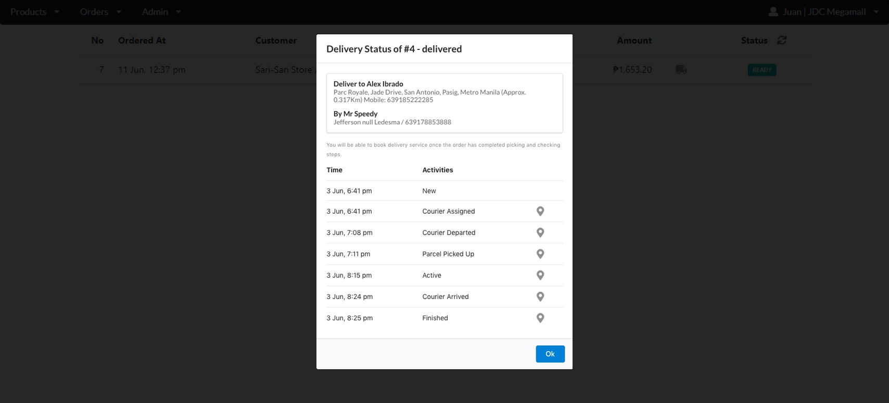

# Order Management with Delivery Partner Integration

## **Reminders Before Booking the Delivery**

**(1)** Make sure that the delivery partner integration is already "ACTIVATED"

**(2)** The Customer Order must have the status as "READY"

**(3)** The Order mode must be for "DELIVERY"

## To Book Delivery (Mr Speedy)

**(1)** At the Order Page, Navigate to For Pickup/Delivery Tab

**(2)** Select the Order and Click on the Truck Icon (Shipping Mode)

**(3)** The status of the Order must be "READY"

**(4)** A Notification Dialog will appear, Click on Book Delivery

**(5)** Configure More options (optional)

* Insured Delivery
* Insulated Box

**(6)** Once Finalized, Click on Book Delivery and Ok to confirm

**(7)** When the Booking Status is "Parcel Picked Up"

**(8)** The Order Status will automatically be changed to Delivering

**(9)** And when "Finished" the Order status will change to "Received"

### Insured Delivery

* When the Items are damaged/lost during delivery, the delivering merchant will pay the parcels declared value

### Insulated Box

* Choosing this option may lengthen the booking waiting time and may include additional cost
* Booking with Insulated box is recommended for delivering items that are temperature sensitive



<figure><figcaption></figcaption></figure>

 

<figure><figcaption></figcaption></figure>

