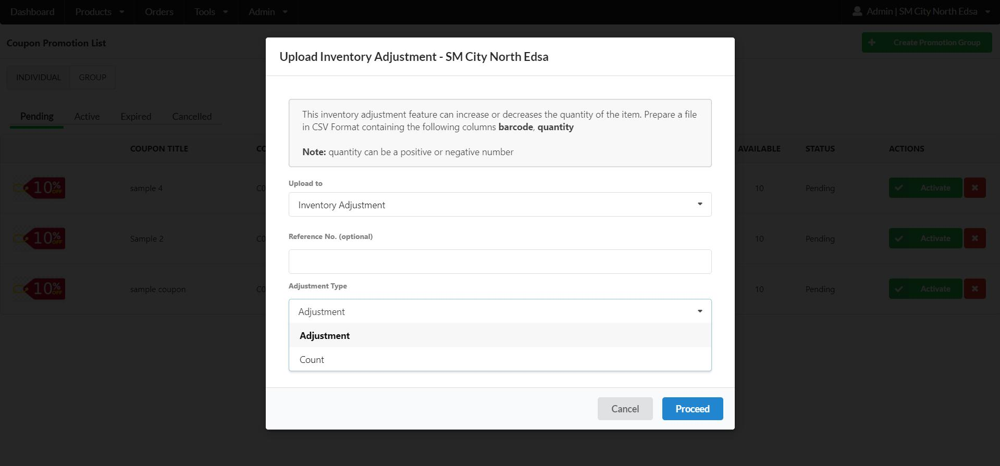

# Inventory Quantities

## To Prepare Inventory CSV file

**(1)** Download the Sample Template CSV File

**(2)** Open the file in Google Sheets and Navigate to the **INVENTORY QUANTITY TAB**

**(3)** You will see some sample entries

**(4)** Replace the examples with your products

* Barcode
* Quantity

**(5)** Click File > Download > Comma-separated values (.csv)

| barcode | quantity |
| ------- | -------- |
| 77777   | 100      |

## To Upload the Inventory Quantities

**(1)** On the Menu Bar, Go to Admin > Uploads > Upload Inventory

**(2)** Press the Choose File button and Navigate to the location of your Inventory CSV file

**(3)** Click Proceed and then OK to Upload your File

**(4)** A Notification will appear indicating that you have successfully Uploaded your Inventory Products

**(5)** Click OK to close the notification



## To Check Inventory Quantity Application

**(1)** On the Menu Bar, Go to Products > Active Items

**(2)** The Product Page will Appear along with the Available Quantity



## To Upload Inventory as Inventory Adjustment

**(1)** On the Menu Bar, Go to Admin > Uploads > Upload Inventory

**(2)** On the Dropdown, Select Inventory Adjustment

**(3)** Enter the Reference number

**(4)** Press the Choose File button and Navigate to the location of your Inventory CSV file

**(5)** Click Proceed and then OK to Upload your File

**(6)** A Notification will appear indicating that you have successfully Uploaded your Inventory Products

**(7)** Click OK to close the notification


The vendor can upload a file that has negative value that will subtract the existing quantity to re-uploaded file that has negative value


<figure><figcaption></figcaption></figure>

### Inventory Adjustment Type

This will allow the vendor to select a behaviour of uploading inventories

#### Count

* if the vendor has Existing Quantity and the vendor Re-upload different quantity, the Quantity of the Re-uploaded file will override the Existing Quantity

#### Adjustment&#x20;

* if the vendor has Existing Quantity and the vendor Re-upload different quantity, the Quantity of the Re-uploaded file will add/subract to Existing Quantity
