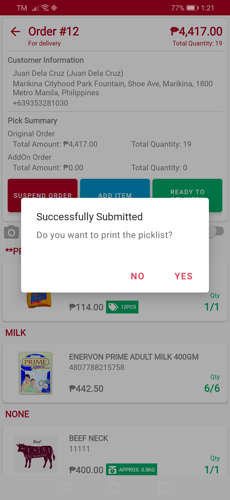

# Picker App Mobile Settings View

<figure><figcaption>
Picker App Settings
</figcaption></figure>

 

<figure><figcaption>
Swipe to Mark Items as Picked
</figcaption></figure>

 

<figure><figcaption>
Manual Changing of Quantity
</figcaption></figure>

 

<figure><figcaption>
Manual Changing of Weight
</figcaption></figure>

 

<figure><figcaption>
Enable Print of Picklist
</figcaption></figure>

 

<figure><figcaption>
Pick List Print Out
</figcaption></figure>

