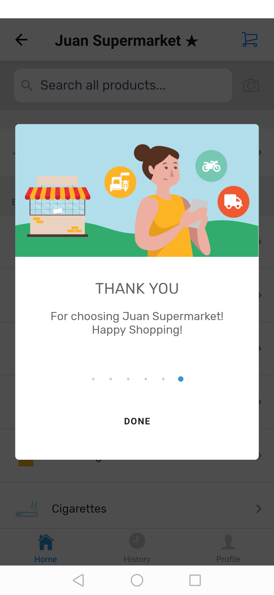

# Vendor Announcements

## Adding an Announcement

This enables the vendor to post announcements at the mobile application before customers start shopping into their store, The vendor can add one or more announcements to the customer, The announcement will display upon tapping Shop Now

**(1)** At the Menu bar, Navigate to Admin > Integration > My Suki App

**(2)** Navigate to Information Tab. The Information Page will appear

**(3)** Click on the Add Announcement Button

**(4)** Select an Image Icon for your Announcement

**(5)** Enter the Title and the Message of your Announcement

**(6)** Click on Ok to Confirm and Update to Save



## Editing an Announcement

This enables the vendor to change the announcements at the mobile application

**(1)** At the Menu bar, Navigate to Admin > Integration > My Suki App

**(2)** Navigate to Information Tab. The Information Page will appear

**(3)** Click on the Edit Icon of the Announcement record you wish to change

**(4)** You may change the Image, Title or the Message

**(5)** Click on Ok to Confirm and Update to Save



## Deleting an Announcement

This enables the vendor to delete an announcement record

**(1)** At the Menu bar, Navigate to Admin > Integration > My Suki App

**(2)** Navigate to Information Tab. The Information Page will appear

**(3)** Click on the Delete Icon of the Announcement record you wish to remove

**(4)** The Announcement record will be deleted

**(5)** Click on Update to Save



## Announcement View at Mobile

This shows the announcement feature at the Mobile Application

<figure><figcaption></figcaption></figure>

 

<figure><figcaption></figcaption></figure>

 

<figure><figcaption></figcaption></figure>

 

<figure><figcaption></figcaption></figure>

 

<figure><figcaption></figcaption></figure>

 

<figure><figcaption></figcaption></figure>

