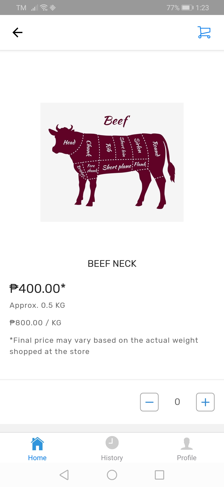

# Viewing Weighted Items

## To View Weighted Items at the Portal

**(1)** Navigate to Products > Active Items

**(2)** Search for the Product Name

**(3)** Select the Product Name

**(4)** The Product information will appear

<figure><figcaption></figcaption></figure>

 

<figure><figcaption></figcaption></figure>

## To View Weighted Items During Order Processing

**(1)** Navigate to Orders > In Progress Order

**(2)** Select the Order Line

**(3)** The Order Information will appear

<figure><figcaption></figcaption></figure>

 

<figure><figcaption></figcaption></figure>

## To View Weighted Items at the My Suki App

**(1)** Navigate to the Store > Shop Now

**(2)** Search for the Product Name

**(3)** Select the Product Name

**(4)** The Product information will appear

<figure><figcaption></figcaption></figure>

 

<figure><figcaption></figcaption></figure>

 

<figure><figcaption></figcaption></figure>

 

<figure><figcaption></figcaption></figure>

