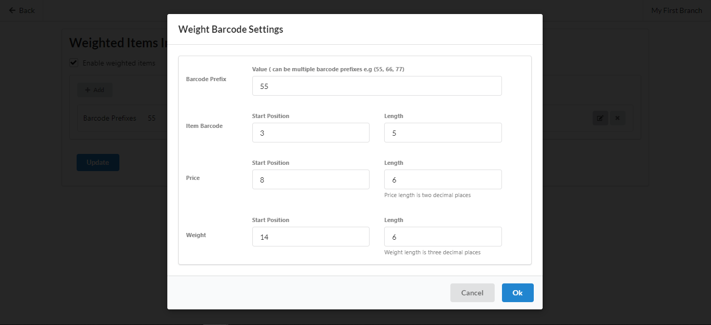

# Weighted Items Settings

## To Activate Weighted Items Feature

**(1)** At the Manu bar, Navigate to Admin > Integrations > Weighted Items

**(2)** Tick the "Enable" Weighted Items Box

**(3)** Click on Update



## To Add New Weighted Item Format

**(1)** At the Weighted Items Section, Click Add "weighted item format" button

**(2)** Enter the Barcode Prefix (ex. 55)

**(3)** Enter the Item Barcode Start Position (ex. 3)

**(4)** Enter the Item Barcode Length (ex. 5)

**(5)** Enter the Price Start Position (ex. 8)

**(6)** Enter the Price Lengths (ex. 6)

**(7)** Enter the Weight Start Position (ex. 14)

**(8)** Enter the Weight Length (ex. 6)

**(9)** Click on Ok and Update


The Price Length Considers two decimal places and three decimal places for Weight Length, One or more Weighted item Format can be added




<figure><figcaption></figcaption></figure>

 

<figure><figcaption></figcaption></figure>

## To Edit Barcode Setting Record

**(1)** At the Barcode Line click on the Edit Icon

**(2)** Edit the Barcode Setting Details

**(3)** Click on Ok and Update



## To Delete Barcode Setting Record

**(1)** At the Barcode Line click on the Delete Icon

**(2)** The Barcode Setting will be deleted

**(3)** Click on Update


